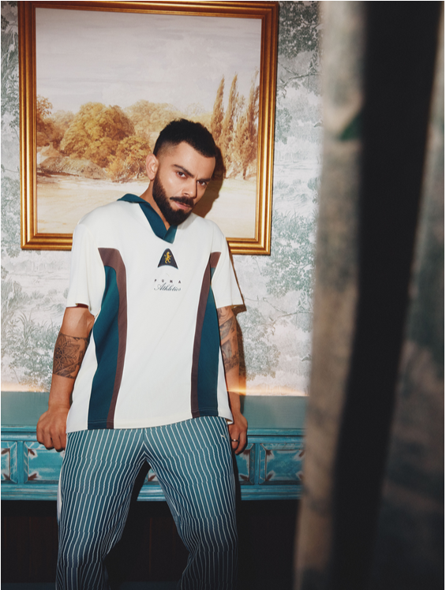

# Puma UI Clone

This repository contains a responsive clone of the Puma website UI, developed using only HTML and CSS. This project recreates the visual design and layout of the Puma website, offering a similar user experience.

## Features

- **Responsive Design**: The UI adapts to various screen sizes, providing a seamless experience on desktops, tablets, and mobile devices.
- **Pure HTML and CSS**: Built without JavaScript or any frameworks, focusing purely on HTML and CSS for structure and styling.
- **Modern Styling**: Emulates the clean, modern aesthetic of the original Puma website.

## Live Demo

Check out the live version of the project [here](https://puma-ui-clone.vercel.app/) 

